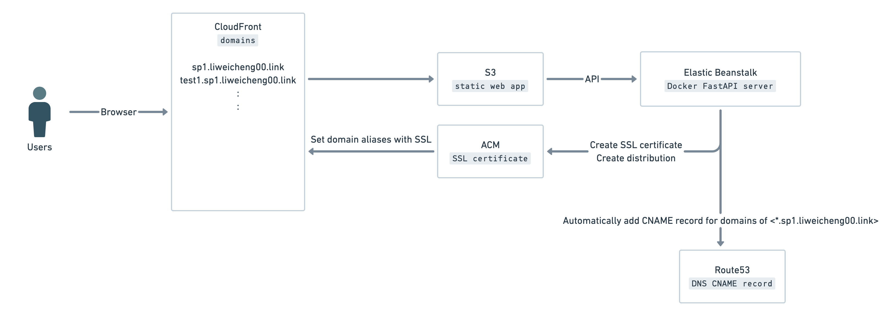

### Explanation
* The server create cloudfront distribution and SSL certificate for domain owed by the user.
* After the SSL certificate is verified by AWS ACM, the server set domain aliases to the distribution.
> Note that distributions can point to different S3 origin for proposes. 
> For example, APIs trigger CI/CD workflow to build another front-end static files with difference third party servers key and deploy to other s3 buckets.

 
